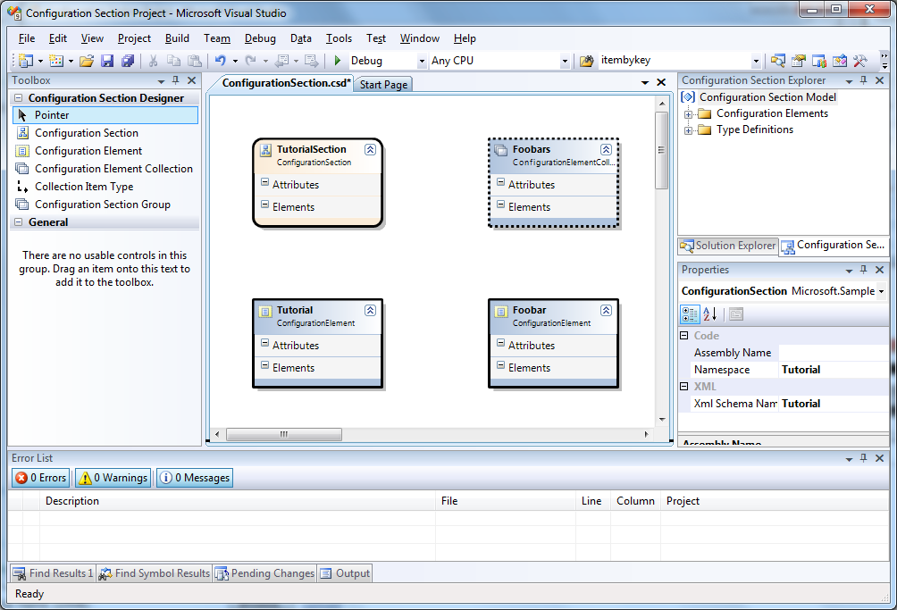
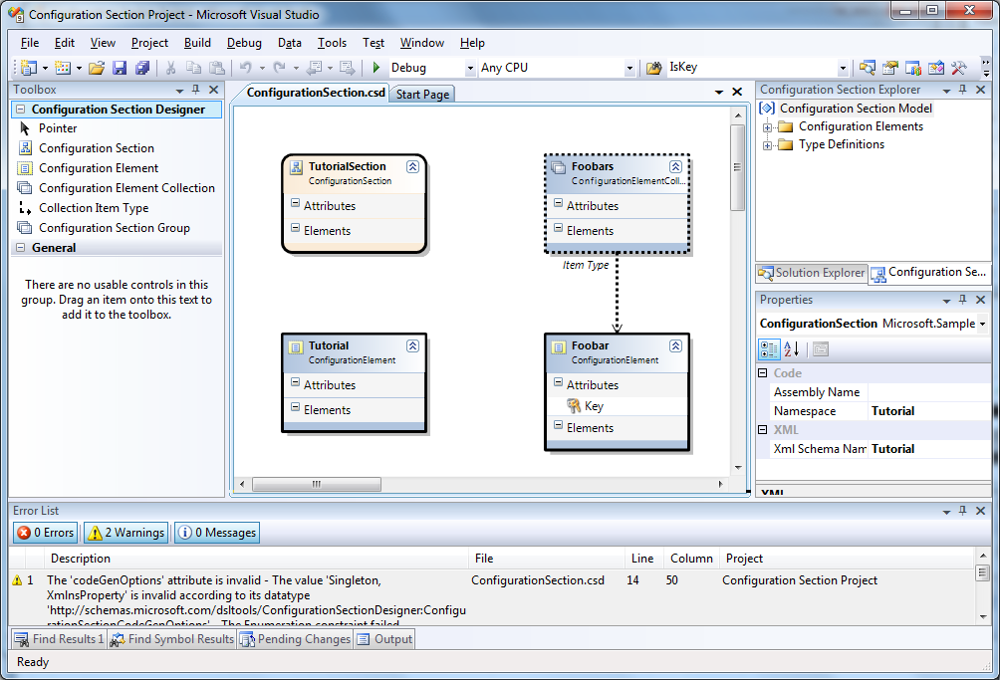
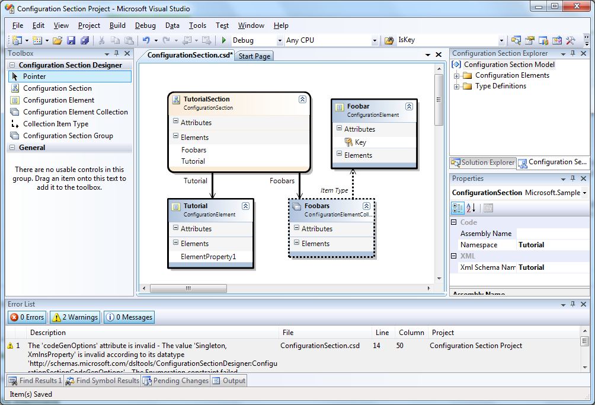
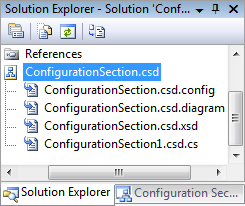

# Adding elements to the Configuration Section Designer diagram 

If you do not already have a blank Configuration Section Designer in front of you, either [create a new project](Creating-a-new-Configuration-Section-Designer-project) or [add one to your existing project](Creating-a-new-Configuration-Section-Designer-diagram). You should have a blank designer like in the image below.

## Setting namespaces

You'll notice that the _Error List_ has a couple of errors coming from our new file. Whenever the diagram is in an illegal state, it will report why to the _Error List_. What we need to do first is to tell the diagram what we want our namespace to be, and what we want our XML namespace to be. In order to do this, right click the blank diagram and select **Properties**. As you see in the image above, the two namespace properties are initially blank. Let's set them both to "Tutorial". After you have filled them both in, save the diagram. You'll notice that the errors are now gone from the error list.

The namespace you set here will be used as the default namespace in which to place the generated configuration classes. It is possible to set different namespaces on a per-element basis as well, if necessary. The XML namespace will be used as the namespace in the generated XML Schema and sample configuration file.

## Adding elements

Open the toolbox if it's not already open. You do this by selecting **View -> Toolbox**. The toolbox will have a group called "Configuration Section Designer" which contains the kinds of elements we can use. Let's add a section, an element collection and two elements. Name the section "TutorialSection", the collection "Foobars", and the two elements "Tutorial" and "Foobar". Your diagram should now look something approximately like the image below.

## Configuring element collections

Not too bad, huh? However, there's still some work left before we can save without the designer giving us complaints. Let's take the collection first. The collection has to be given a item type. By convention, I name the collection a plural, and the element the corresponding singular, such as "Servers" and "Server" respectively. Thus, for our example, the item type of the _Foobars_ collection will be the _Foobar_. There are two ways to set the type. You can either set it in the _Properties_ pane in the property _Item Type_ or you can use the _Collection Item Type_ connector tool from the toolbox. Let's use the toolbox, it's more fun. Click the _Collection Item Type_ tool, then click the _Foobars_ element, and finally, click the _Foobar_ element. Behold, a connector shows up between the two elements.

Finally, the element type of the collection needs to be given a key property. Right click the _Attributes_ compartment on the _Foobar_ element and select **Add new Attribute**. Name it "Key". In the _Properties_ pane for the attribute, set the _IsKey_ attribute to true and the _Type_ attribute to _String_. Save the diagram. It should save without any errors. Your diagram will now look like in the image below.

**Tangent:** You will probably get the same warnings that are showing up in my error list sooner or later. These are safe to ignore, I'm not going to bore you with the details, but they are caused by attempting to store things in XML in a way that cannot be expressed with an XML schema. Again, just ignore them.

## Associating elements with each other

The last thing we need to do is make the _Tutorial_ element and _Foobars_ collection be accessible from our _TutorialSection_. Right click the _Elements_ compartment on the _TutorialSection_ and select **Add new Element**. Name it "Foobars". In the _Properties_ pane for the element, set the _Type_ to _Foobars_. Do it again, but name it "Tutorial" and set the type to _Tutorial_.

**Tangent:** In doing this, you will probably come across a bug that we have not yet figured out how to fix, which is that when an element attribute's element type on the right side of the containing element, the edges of the two will be like they are glued together. My recommendation: Until the bug is fixed, build the configuration hierarchy in a downwards fashion. The exception is the Item Type of configuration element collections, these do not suffer from the bug and may safely be placed to the right of their collections.

In any case, we are done, you should have a diagram that looks approximately like the one in the image below:

And there you have it. What's next? For starters, you may want to take a look at the generated code, XML schema and sample configuration files. You find these by expanding the Configuration Section Designer node. (If you're using Visual Basic, you'll need to enable **Show All Files** in order to see the generated files. Generated files are hidden by default in Visual Basic.)

Need even more to do? Try adding more attributes and elements. Explore the different settings on the different kinds of elements.