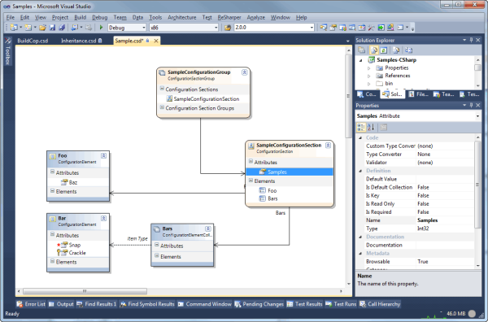
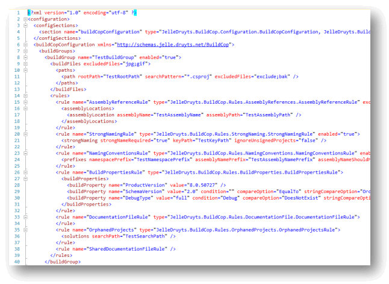

# Project moving to GITHUB due to CodePlex closure!

[https://github.com/hybridview/ConfigurationSectionDesigner](https://github.com/hybridview/ConfigurationSectionDesigner)

# Project Description

A Visual Studio add-in that allows you to graphically design .NET Configuration Sections and automatically generates all the required code and a schema definition (XSD) for them.

For installation and usage instructions, see the [documentation](documentation). 

Visual Studio 2010 users may also find Configuration Section Designer at the [Visual Studio Gallery](http://visualstudiogallery.msdn.microsoft.com/2a69f74e-83df-4eb0-8cac-cd83b451cd1d), though it is recommeded that you get it from CodePlex since it is updated more often.

## Simple Example

## Generated Code

## Example Configuration File

