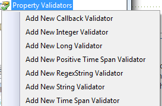
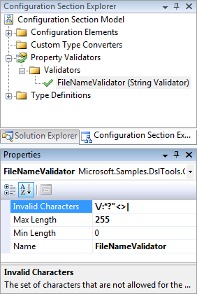

# Validation

By default, a property on a configuration element may contain anything. Sometimes, however, you want more control over what goes into a setting, be it a valid range of numbers or a specific type of string. This is called validation, and the Configuration Section Designer has made the feature very simple to use. In the _Configuration Section Explorer_ there's a node called _Property Validators_. If you right-click this node, you get the option of adding various kinds of validators, from the simplest _Positive Time Span Validator_ to the most complicated _Callback Validator_.

## Ordinary validator

Let's add a String Validator. When you have added your validator, right click it and select **Properties**. All validator types will have a _Name_ property. This is the identifier of the validator, which is shown when you pick a validator for a property. It's a good idea to name them after their purpose. I'm going to name mine "FileNameValidator" because I'm going to use it to validate a file name. The String Validator has three settings, one for invalid characters, one for minimum length and one for maximum length. The longest allowed file name on Windows is 255 characters long, so we'll set the MaxLength to 255. Furthermore, we need to set some invalid characters. I'm sure at some point you've come across this warning in Windows Explorer:

Thus, we're going to set the Invalid Characters property to "\/:*?"<>|". Our FileNameValidator should now look like this:

The final step is just creating a configuration element that has a String property, and set its _Validator_ property to _FileNameValidator_. If you take a look at the generated code, you'll see this added to the property you set the validator on:

{code:c#}
[global::System.Configuration.StringValidatorAttribute(InvalidCharacters="\\/:*?\"<>](_,-MaxLength=255,-MinLength=0))
{code:c#}

That's how you create and use ordinary validators. (**NOTE**: The rules for valid file names in Windows are actually quite a bit more complicated than this, and cannot be expressed using a simple _StringValidator_.)

## Callback validators

Sometimes, the functionality of the built-in validators are not enough. The type of the property you want to check may be custom, or the valid values for an integer property may only be prime numbers. If you need this kind of specialized validation, the callback validator is the one you want.

Add a _Callback Validator_ and name it "PrimeValidator". It only has one property, _Callback_. This is the name of the method you want to do the property validation in. Let's name it "Prime". When you check the generated code, you'll see a class named _PrimeValidatorCallbackValidatorClass_ with a method called _PrimeCallback_. In this method, a call to _Prime_ is being made. This is the method you named in the _Callback_ property. Create a new file and paste the suggested implementation in the comments of the _PrimeCallback_ in. Then, write your validation code. The convention is that you throw an _ArgumentException_ if you come across an invalid value. This is my validation code for the primes under 100:

{code:c#}
namespace Tutorial
{
    public partial class PrimeValidatorCallbackValidatorClass
    {
        public static void Prime( object value )
        {
            if( value == null )
                throw new ArgumentNullException( "value" );

            if( !(value is int) )
                throw new ArgumentException( "PrimeValidator only validates integers" );

            int number = (int)value;
            switch( number )
            {
                case 2:
                case 3:
                case 5:
                case 7:
                case 11:
                case 13:
                case 17:
                case 19:
                case 23:
                case 29:
                case 31:
                case 37:
                case 41:
                case 43:
                case 47:
                case 53:
                case 59:
                case 61:
                case 67:
                case 71:
                case 73:
                case 79:
                case 83:
                case 89:
                case 97:
                    break;

                default:
                    throw new ArgumentException( "The given value is not a prime number" );
            }
        }
    }
}
{code:c#}

And that's more or less what there is to say about validators. I hope you find them useful.